# Automatic Identification System — Kinematic Anomaly Detection

**Detecting suspicious vessel behavior from ship-tracking data.** This project ingests historical and
live AIS (Automatic Identification System) data, learns what normal vessel movement looks like, and
flags behavior that warrants a closer look: loitering offshore, switching the transponder off,
meeting another vessel at sea, spoofed positions, and leaving normal shipping lanes.

Every detector — from simple rules to deep learning — is scored on the same benchmark, then run
against a live feed so its alert volume can be measured the way an operations team would
experience it.

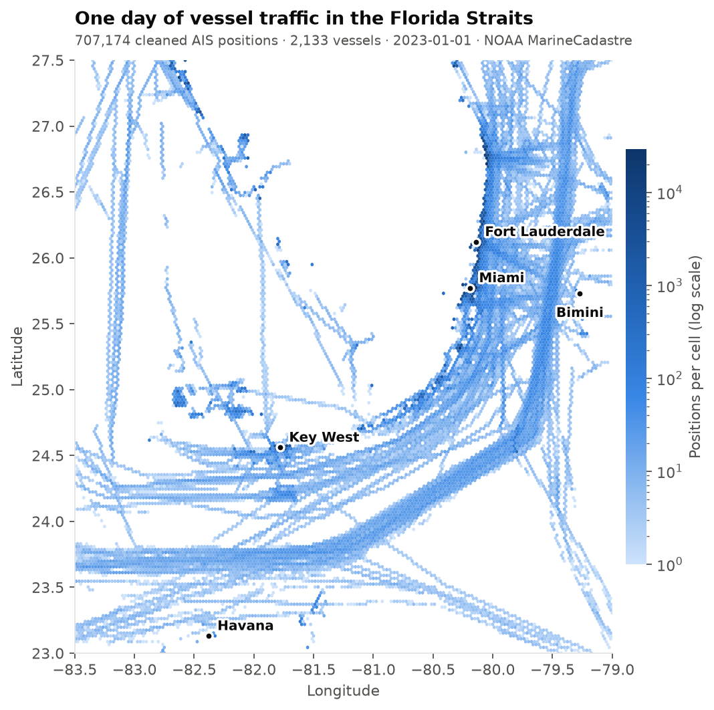

---

## Contents

- [Why this problem](#why-this-problem)
- [What AIS data looks like](#what-ais-data-looks-like)
- [Behaviors we detect](#behaviors-we-detect)
- [Architecture](#architecture)
- [Pipeline, stage by stage](#pipeline-stage-by-stage)
- [Project structure](#project-structure)
- [Quickstart](#quickstart)
- [Roadmap](#roadmap)
- [Tech stack](#tech-stack)
- [Data sources and attribution](#data-sources-and-attribution)

---

## Why this problem

Most ships broadcast their identity, position, speed and heading every few seconds over AIS. That
creates a huge stream of movement data — over 700,000 position reports per day in the Florida Straits
alone — and nobody can watch it by eye. The interesting events are rare and hide inside normal
traffic:

- A boat that **stops broadcasting** for two hours and reappears 30 miles away.
- Two vessels that **meet offshore**, idle side by side, then head in different directions.
- A position that **teleports** faster than any ship could travel.

The goal is to turn that stream into a short, ranked list of tracks worth an analyst's time, with
honest numbers on how many real events are caught and how many false alarms it costs.

**Region:** the **Florida Straits** (lat 23.0–27.5, lon −83.5 to −79.0), a busy chokepoint between
Florida, Cuba and the Bahamas with heavy cargo, cruise and small-craft traffic.

---

## What AIS data looks like

Each row is one position report from one vessel:

| Field | Example | Meaning |
|---|---|---|
| `mmsi` | `367468230` | 9-digit vessel ID (first 3 digits = flag country) |
| `ts` | `2023-01-01T19:32:28Z` | Report time (UTC) |
| `lat`, `lon` | `25.21, -80.21` | Position |
| `sog` | `12.4` | Speed over ground (knots) |
| `cog` | `184.0` | Course over ground (degrees) |
| `heading` | `183` | Direction the bow points (degrees) |
| `nav_status` | `0` | Self-reported status (underway, anchored, moored, fishing…) |
| `vessel_type` | `37` | Ship-type code (pleasure craft, cargo, tanker…) |
| `length`, `width`, `draft` | `12, 4, 1.2` | Dimensions (metres) |

The data is messy in ways that matter. Fields use magic "not available" values (speed `102.3`,
heading `511`), IDs are mistyped or shared, receivers drop messages, and GPS occasionally throws a
position tens of kilometres off. Separating **sensor noise** from **genuinely odd behavior** is the
core challenge.

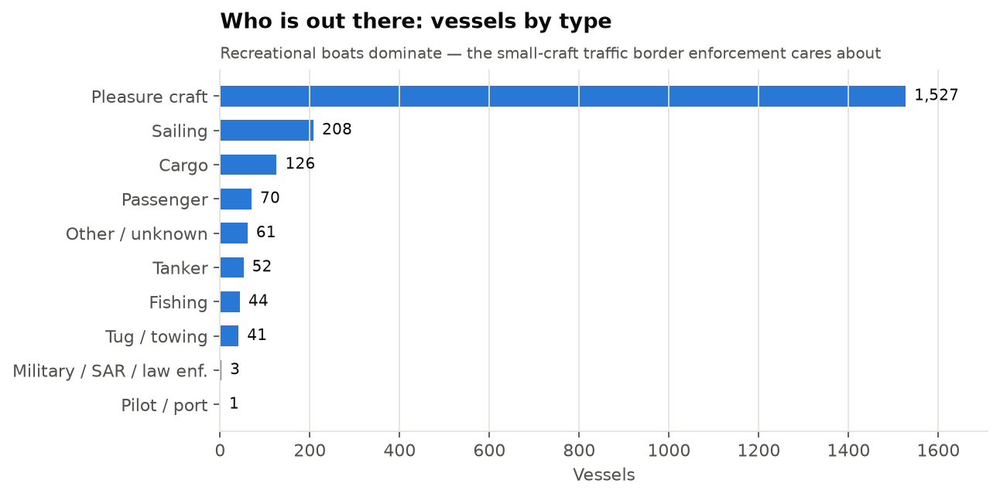

Recreational boats make up most of the traffic — exactly the small-craft population that is hardest
to monitor and most relevant to border and maritime security.

---

## Behaviors we detect

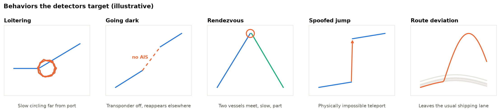

| Behavior | What it looks like in the data | Key signals |
|---|---|---|
| **Loitering** | Low speed, high turning, small area, far from port | Speed, turn rate, radius of gyration, distance to port |
| **Going dark** | Long reporting gap mid-voyage, often in open water | Gap duration, distance covered during gap, implied speed across gap |
| **Rendezvous** | Two vessels within a few hundred metres, both slow, away from port | Pairwise distance, co-located slow time, vessel types |
| **Spoofed jump** | Position jumps an impossible distance and stays there | Implied speed between fixes, mismatch between reported and implied speed |
| **Route deviation** | Track leaves the corridor that similar vessels normally follow | Distance to nearest learned route cluster |

---

## Architecture

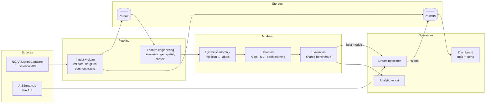

Historical and live data are mapped to **one shared schema**, so cleaning, features and models are
written once and run on both. The full component-level diagram is in
[docs/architecture.md](docs/architecture.md).

---

## Pipeline, stage by stage

### 1. Ingest and clean ✅

`kad ingest` downloads NOAA's daily nationwide file (~320 MB zipped, ~880 MB of CSV) and streams it
in chunks, keeping only rows inside the region. `kad clean` then applies validation rules in order
and records how many rows each rule removed:

| Rule | Action |
|---|---|
| Invalid vessel ID | Drop anything that isn't a 9-digit ship MMSI with a valid country code (201–775) |
| Invalid coordinates | Drop out-of-range and (0, 0) positions |
| "Not available" values | Speed 102.3, course 360, heading 511 → null |
| Duplicate timestamps | Keep the first report per vessel per second |
| GPS glitches | Drop a fix that jumps away **and** straight back at > 50 kn over > 1 km |
| Track segmentation | Start a new track after a gap > 30 min; keep the gap length |
| Short tracks | Drop tracks with fewer than 10 reports |

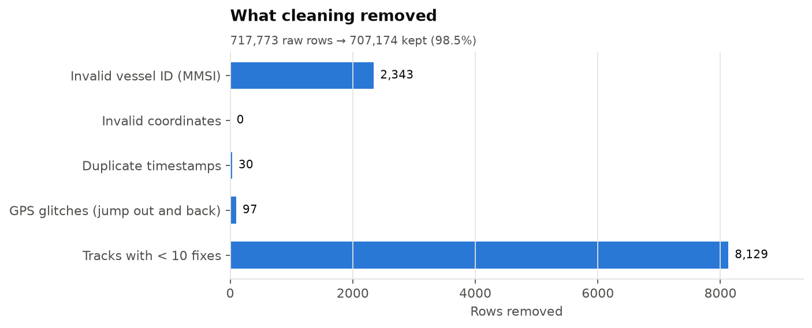

**Glitch vs. spoof.** A single fix that jumps out and back is sensor noise and is removed. A jump
that *stays* is kept — that pattern is a spoofing signal the detectors need to see.

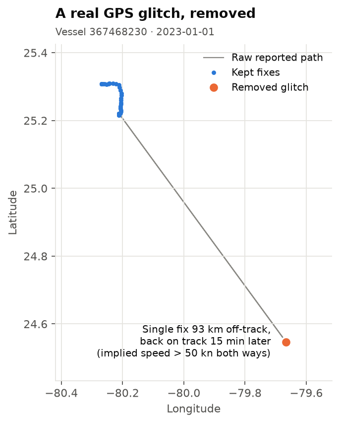

**Gaps become features, not just splits.** Most vessels report every few seconds to minutes. Gaps
longer than 30 minutes start a new track, and their length is stored so the "going dark" detector
can use it.

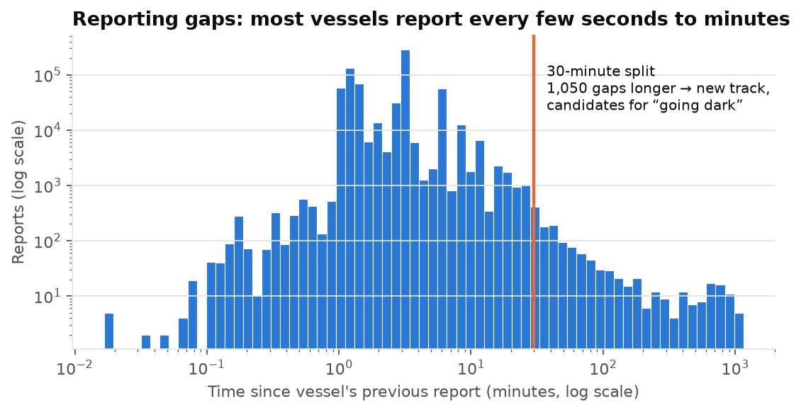

### 2. Storage ✅

Cleaned data is written to Parquet (fast for modeling) and loaded into PostgreSQL + PostGIS (spatial
queries, the live scorer and the dashboard).

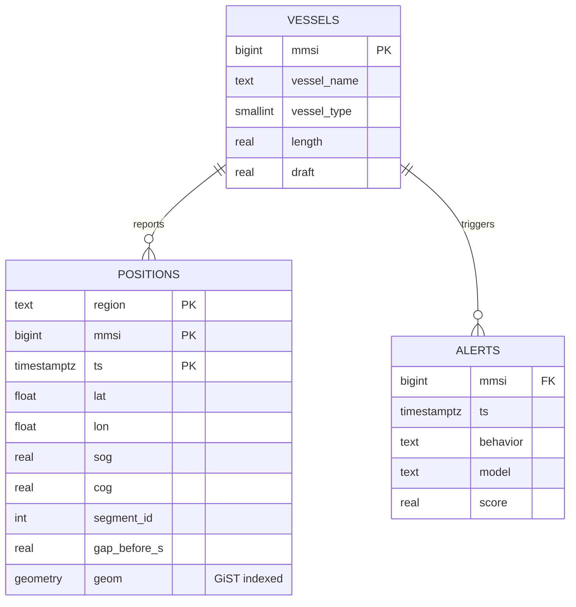

`ALERTS` is added in phase 6.

### 3. Feature engineering

| Group | Features |
|---|---|
| **Kinematic** | Speed, acceleration, turn rate, heading change, heading vs. course mismatch, reported vs. implied speed |
| **Temporal** | Gap before/after, time of day, rolling-window statistics (mean, variance, max) over 5/15/60 min |
| **Geospatial** | Distance to shore, nearest port, nearest shipping lane; local traffic density |
| **Track shape** | Radius of gyration, straightness (net vs. path distance), area covered |
| **Context** | Vessel type and size, number of vessels within 1 km, typical behavior for this type in this grid cell |

### 4. Labels: synthetic anomaly injection

Real labeled anomalies don't exist in public data, so we create them. Known behaviors are injected
into real, clean tracks, giving exact ground truth while keeping realistic noise and traffic around
them.

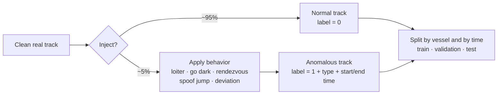

Splitting **by vessel and by time** stops a model from scoring well just because it has already seen
the same boat or the same day.

### 5. Detectors

Three tiers, each of which has to beat the one before it:

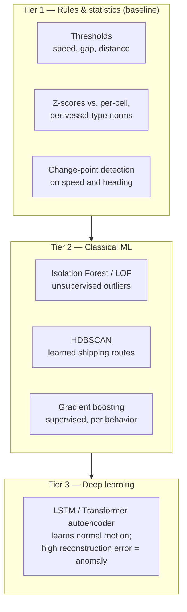

### 6. Evaluation

Every detector is scored on the same held-out test set:

| Metric | Why it matters |
|---|---|
| Precision, recall, PR-AUC | Anomalies are rare, so PR-AUC is more honest than accuracy or ROC-AUC |
| Detection delay | How long after a behavior starts it gets flagged |
| False alarms per 1,000 tracks | What an operator actually feels |
| Per-behavior breakdown | A model can be great at spoofing and useless at rendezvous |
| Bootstrap CIs + McNemar's test | Whether one model's lead over another is real or noise |

### 7. Live scoring

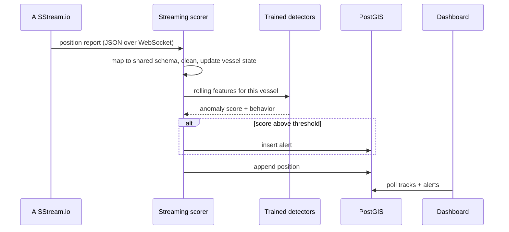

When the live feed is unavailable, the same scorer replays NOAA data in time order. That also powers
the **threshold study**: how alert volume and detection rate trade off as the alert threshold
changes.

---

## Project structure

```
.
├── README.md
├── docs/
│   ├── architecture.md          # full component diagram
│   └── img/                     # README figures
├── docker-compose.yml           # PostgreSQL + PostGIS
├── sql/schema.sql               # tables + spatial indexes
├── scripts/
│   └── make_readme_figures.py   # regenerates docs/img/
├── src/kad/
│   ├── cli.py                   # `kad` command
│   ├── config.py                # regions, paths, DB URL
│   ├── schema.py                # shared column schema, vessel categories
│   ├── geo.py                   # haversine distance
│   ├── ingest.py                # NOAA download + region filter
│   ├── clean.py                 # validation, de-glitching, segmentation
│   ├── db.py                    # PostGIS loading
│   ├── features/                # (phase 2)
│   ├── synth.py                 # (phase 3) anomaly injection
│   ├── models/                  # (phases 2–5) rules, ML, deep learning
│   ├── evaluate.py              # (phase 3)
│   ├── live.py                  # (phase 6) AISStream client
│   └── simulate.py              # (phase 6) streaming scorer
├── app/                         # (phase 6) dashboard
└── tests/
```

---

## Quickstart

```bash
python -m venv env && env/bin/pip install -e ".[dev]"
docker compose up -d                              # PostgreSQL + PostGIS on :5432

kad ingest --start 2023-01-01 --end 2023-01-07    # download + filter  -> data/raw/
kad clean  --start 2023-01-01 --end 2023-01-07    # validate + segment -> data/clean/
kad load                                          # -> PostGIS

python scripts/make_readme_figures.py             # regenerate figures
pytest
```

`--region` accepts `florida_straits` (default), `gulf_of_mexico` or `southern_california`.

---

## Roadmap

| Phase | Scope | Status |
|---|---|---|
| 1 | Ingest, clean, store (Parquet + PostGIS) | ✅ Done |
| 2 | Feature engineering + rule/statistical baselines | ⏳ Next |
| 3 | Synthetic anomaly injection + evaluation framework | Planned |
| 4 | Classical ML: Isolation Forest, HDBSCAN routes, gradient boosting | Planned |
| 5 | Deep learning: PyTorch sequence autoencoder | Planned |
| 6 | Live AISStream scorer, alerts table, map dashboard | Planned |
| 7 | Analytic report: methods, results, recommendations | Planned |

---

## Tech stack

| Area | Tools |
|---|---|
| Language | Python 3.11+ |
| Data | pandas, NumPy, PyArrow / Parquet |
| Geospatial | PostGIS, haversine geometry |
| Statistics & ML | SciPy, scikit-learn, HDBSCAN, LightGBM |
| Deep learning | PyTorch |
| Database | PostgreSQL 16 + PostGIS 3.4 (Docker) |
| Visualization | matplotlib, Streamlit / Folium dashboard |
| Quality | pytest, ruff |

---

## Data sources and attribution

- **Historical AIS:** [NOAA Office for Coastal Management, MarineCadastre.gov — Vessel Traffic](https://hub.marinecadastre.gov/pages/vesseltraffic).
  Public domain U.S. government data. Coverage comes from U.S. shore-based receivers, so it thins
  toward Cuba and the Bahamas.
- **Live AIS:** [AISStream.io](https://aisstream.io) (free, API key required).

All figures in this README come from real NOAA data for 2023-01-01, except
"Behaviors the detectors target", which is an illustrative sketch.
