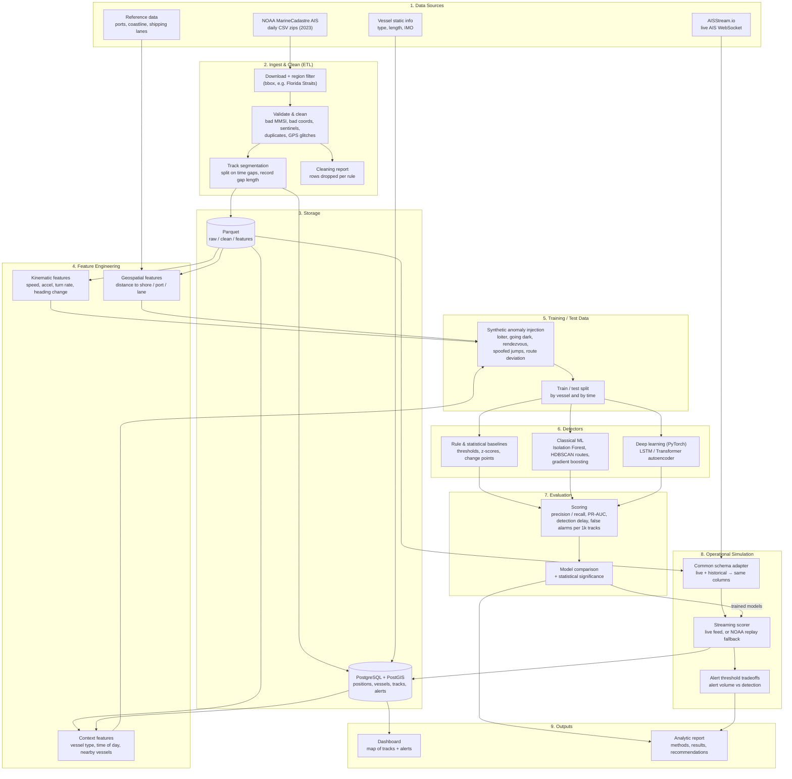

# Architecture

## Code layout (planned)

| Stage | Module |
|---|---|
| Ingest | `src/kad/ingest.py` |
| Clean + segment | `src/kad/clean.py` |
| Storage | `src/kad/db.py`, `sql/schema.sql` |
| Features | `src/kad/features/` |
| Synthetic anomalies | `src/kad/synth.py` |
| Detectors | `src/kad/models/` (`rules.py`, `ml.py`, `deep.py`) |
| Evaluation | `src/kad/evaluate.py` |
| Live feed | `src/kad/live.py` |
| Simulation | `src/kad/simulate.py` |
| Dashboard | `app/` (Streamlit) |
